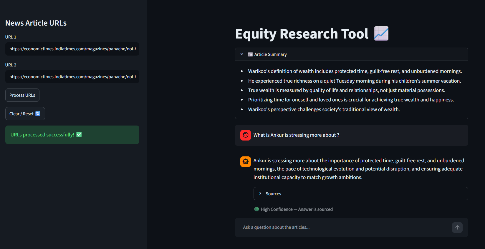

# 📈 Equity Research RAG Assistant

A Generative AI-powered Financial Research Assistant built using Retrieval-Augmented Generation (RAG), LangChain, FAISS, and OpenAI GPT-4.

The application enables users to analyze financial news articles, extract key insights, and ask natural language questions against multiple news sources. By combining semantic search with large language models, the platform delivers context-aware answers grounded in the source articles, helping analysts and investors accelerate research workflows.
---
## 📷 Application Preview


---

## 🚀 Live Demo

**Streamlit Application:**  
https://equity-research-rag-tool-2vtvuhntvdmnglhprs6fhb.streamlit.app/


---

## 📌 Business Problem

Financial analysts spend significant time reading multiple news articles, identifying key developments, and extracting information relevant to investment decisions.

Traditional keyword-based search methods often fail to provide contextual answers across multiple documents.

This project addresses these challenges by providing:

- Automated article ingestion
- Intelligent information retrieval
- Context-aware question answering
- Source-backed responses
- Faster financial research workflows

---

## 🎯 Business Objective

Build a Financial Research Assistant capable of transforming unstructured financial news into actionable insights through Generative AI and Retrieval-Augmented Generation (RAG).

---

## 📰 Data Sources

The application processes live financial news articles directly from URLs.

### Tested News Sources

- Economic Times
- Moneycontrol

The architecture is designed to support additional online news sources with minimal changes.

---

## 🏗️ System Architecture

```text
User URLs
     │
     ▼
Article Extraction
     │
     ▼
Text Chunking
     │
     ▼
Embeddings Generation
     │
     ▼
FAISS Vector Store
     │
     ▼
Semantic Retrieval
     │
     ▼
OpenAI GPT-4
     │
     ▼
Source-Grounded Answers
```

---

## ⚙️ RAG Pipeline

The application implements a complete Retrieval-Augmented Generation workflow:

### 1. Document Loading

Financial news articles are extracted directly from user-provided URLs.

### 2. Text Chunking

Long articles are split into manageable chunks for efficient retrieval.

### 3. Embedding Generation

Article chunks are converted into vector embeddings for semantic similarity search.

### 4. Vector Storage

Embeddings are stored locally using FAISS for fast retrieval.

### 5. Context Retrieval

Relevant document chunks are retrieved based on the user's question.

### 6. LLM Response Generation

Retrieved context is passed to GPT-4 to generate accurate and contextual answers.

### 7. Source Attribution

Answers include supporting source references to improve transparency and trust.

---

## 🤖 LLM & AI Stack

### Large Language Model

- OpenAI GPT-4

### Framework

- LangChain

### Vector Database

- FAISS

### Retrieval Method

- Semantic Similarity Search

---

## 🧠 Key Features

### Multi-Article Research

Analyze multiple financial news articles simultaneously.

### Conversational Q&A

Ask natural language questions about loaded articles.

### Source-Grounded Responses

Answers are generated using retrieved article content.

### Article Summarization

Automatically extract key points from news articles.

### Confidence Indicators

Provides confidence-based answer presentation.

### Source Visibility

View supporting article references behind generated answers.

### Session Reset

Clear previous analysis and start a new research session.

---

## 💬 Example Questions

Users can ask questions such as:

- What are the major risks discussed in these articles?
- What is the overall sentiment toward the company?
- What financial metrics are mentioned?
- What are the key growth drivers?
- What concerns are analysts highlighting?
- Summarize the articles in five bullet points.
- Compare viewpoints across the provided articles.

---

## 🖥️ Application Workflow

### Step 1

Enter one or more financial news article URLs.

### Step 2

Process the articles.

### Step 3

The system:

- Extracts article content
- Chunks the text
- Generates embeddings
- Creates a FAISS vector index

### Step 4

Ask questions in natural language.

### Step 5

Receive source-backed answers generated using GPT-4.

---

## 📂 Project Structure

```text
.
├── .streamlit/
├── assests/
├── utils/
├── vector_index/
├── vector_index_001/
├── app.py
├── main.py
├── backend.py
├── requirements.txt
├── Dockerfile
├── .gitignore
├── .dockerignore
└── README.md
```

---

## 🛠️ Technology Stack

### Programming Language

- Python

### Generative AI

- OpenAI GPT-4

### LLM Orchestration

- LangChain

### Vector Database

- FAISS

### Frontend

- Streamlit

### Data Processing

- Pandas
- NumPy

### Deployment

- Streamlit Cloud

---

## 🔥 Key Highlights

- End-to-End RAG Pipeline
- Financial News Intelligence Platform
- GPT-4 Powered Question Answering
- Semantic Search using FAISS
- Source-Cited Responses
- Multi-Document Analysis
- Real-Time News Research Workflow
- Interactive Streamlit Interface
- Production-Ready Deployment

---

## 📊 Skills Demonstrated

This project showcases practical expertise in:

- Generative AI
- Retrieval-Augmented Generation (RAG)
- Prompt Engineering
- LangChain
- Vector Databases
- Information Retrieval
- Semantic Search
- LLM Application Development
- Streamlit Deployment

---

## 🎯 Portfolio Positioning

This project demonstrates how Generative AI can be applied to solve real-world business problems in financial research and investment analysis by transforming unstructured news content into an interactive question-answering system.

The solution mirrors the type of document intelligence and knowledge retrieval systems increasingly being adopted across financial services, consulting, and enterprise research teams.

---
